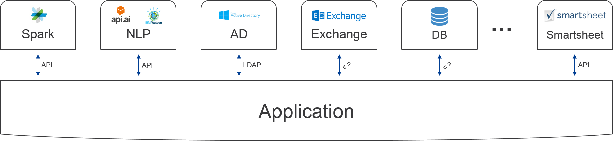
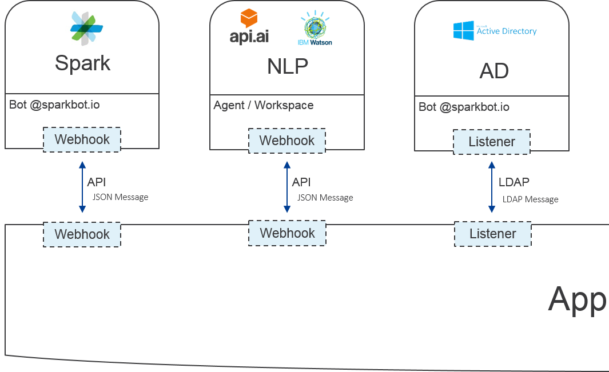
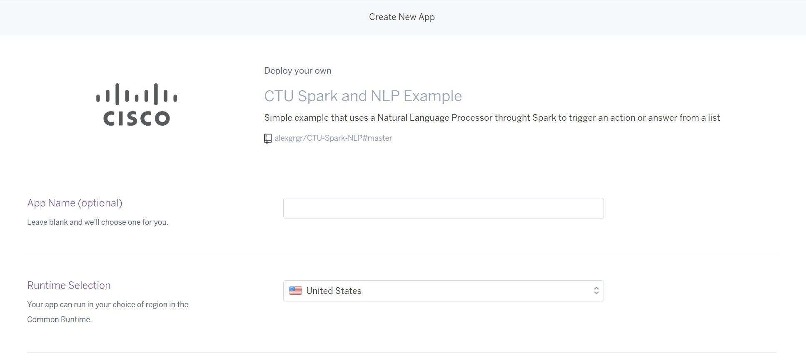
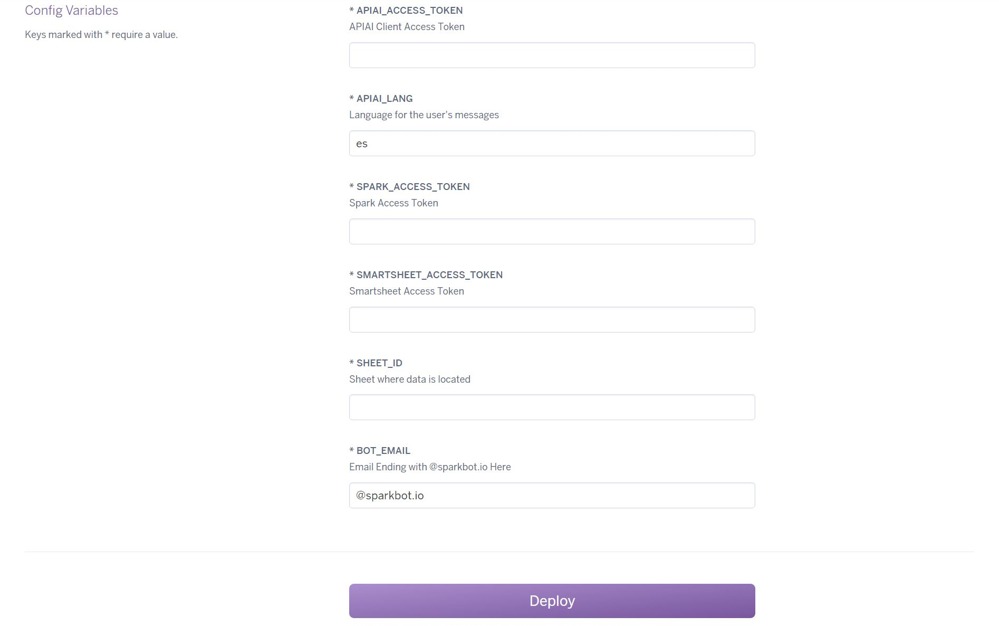

#CTU Spark and NLP integration example

> Take a look to [CTU Spark Commands](https://github.com/alexgrgr/CTU-Spark-Commands) before this exercise


## How to use a Spark Bot to answer a user´s *natural language* question with the ability to retreive data from external sources

This example shows how you can use a NLP (*Natural Language Procesor*), such as `Api.ai` to provide
information allocated at external sources or stored at the NLP database, in an easy way. This information and sources are described later in [`actions`](#actions).

###Use case

A user doesn´t want to use commands to ask for a Telepresence Device Datasheet, so the solution you need is an intermediate with some intelligence that could guess what the user is trying to ask in his human-like question.

Now, your bot will also be able to answer to spare questions so it will look more natural for the user to use it.

As before, possible sensitive data could be stored safely in your databases and in this example we will use *Smartsheet* again for storing the links to the products datasheets.

This is how the new arquitecture looks like:



Everything is deployed and integrated horizontally. Your app contains an interface for each integrated service.



This example contains integrations of your app with *Spark*, *api.ai* and *Smartsheet*.

##Preparation Steps

1. **Create a new bot in Spark**

Please, create a new bot at [Documentation->Creating a Spark Bot](https://developer.ciscospark.com/bots.html#creating-a-spark-bot-account "Create Bot and Generate Access Token") and follow the steps.

 > Write down the access token

 2. **Prepare your Smartsheet's Token**

 As before, this data will be given to you.

 > Write down the access token for a later use.
 > Also, write down the sheet ID

3. **Set your agent at api.ai**

- **Upload intents**
+ [Follow this link](https://github.com/alexgrgr/CTU-Spark-NLP/raw/master/agent/CTU-NLP-Example.zip) and download the zip file.
+ Create a new agent
+ Go to Setting->Import and Export->Restore from zip
+ Select the zip you have just downloaded

- **Get Token**
- Got to Settings->General and copy the *Client access token* under *API KEYS*
> Write down the access token for a later use

4. **Prepare a PaaS (*Platform as a Service*) for executing the code that will compose your bot.**

Again, follow this link to deploy the necessary code automatically on a Dyno:

[](https://heroku.com/deploy)

You will be presented with a page as follow:



+ Select Your App name and save it for later use. Also referred as Dyno Name on this text.
+ Runtime selection, choose Europe
+ Now, set the *environmental variables*!:



|                Variable | Value                                              |
|------------------------:|:---------------------------------------------------|
|      APIAI_ACCESS_TOKEN | Your Client Access Token                           |
|              APIAI_LANG | The language used by users                         |
| SMARTSHEET_ACCESS_TOKEN | Your *Smartsheet*´s Token to access *API*          |
|                SHEET_ID | The *Smartsheet*'s sheet ID were info is located   |
|      SPARK_ACCESS_TOKEN | Your bot´s Token to access *Spark* *API*           |
|               BOT_EMAIL | Your bot´s email to discard its own messages       |

+ Deploy!


5. **Set a WebHook to your Dyno in Spark**

To link Spark with your app you will need to set a target where Spark will send all messages received by the bot. This is called a **Webhook**. Please refer to the following documentation:
 [*Spark WebHook Creation*](https://developer.ciscospark.com/endpoint-webhooks-post.html "Create an Spark Webhook").

You will notice on the left side of the above web the construction of the JSON message needed by Spark in order to contact it's API:

```JSON
{
  "name" : "My Awesome Webhook",
  "targetUrl" : "https://example.com/mywebhook",
  "resource" : "messages",
  "event" : "created",
  "filter" : "roomId=Y2lzY29zcGFyazovL3VzL1JPT00vYmJjZWIxYWQtNDNmMS0zYjU4LTkxNDctZjE0YmIwYzRkMTU0",
  "secret" : "86dacc007724d8ea666f88fc77d918dad9537a15"
}
```
Clicking on the scroll button you will change the mode to test mode. This allows a developer to send API messages directly from the web browser, instead of using a developer tool.

Your message needs to look this way:
```JSON
{
  "name" : "CTU Spark NLP Example",
  "targetUrl" : "https://[yourdynoname].herokuapp.com/webhook",
  "resource" : "messages",
  "event" : "created",
}
```
So you must set the following parameters:
+ **name**: `CTU Spark NLP Example`
+ **targetUrl**: where `[yourdynoname]` is the name given before to your Dyno
+ **resource**: `messages`
+ **event**: `created`

> Now Spark knows where on the internet it must send the messages referred to your bot

6. **Set a WebHook to your Dyno in api.ai**

Finally, set api.ai WebHook to target your app. Go to *Fulfillment*, select enable and set URL as `https://[yourdynoname].herokuapp.com/apiai`. This will make your app know that the one asking is api.ai, and a different code will be executed.

##Ready

+ Any time your bot is mentioned in a Space, or chatted on a 1-to-1 Space, Spark will send a WebHook to `https://[yourdynoname].herokuapp.com/webhook`
+ Your Dyno is composed of some *Python* code over a web framework called *Flask*. Everytime a `GET` http request is received on the URL path `/webhook`, some code will be executed.
+ First of all, the WebHook does not include the message. Instead, a `messageId` is provided. So in order to have it, a `GET` http request is sent to Spark.
+ Then, the message `/search [something]` from a user will be decompossed into the command and the query.
+ If no identificable command is present, your app will send the message to api.ai to identify it
+ If the answer is known by api.ai, user will be answered with it
+ If the answer needs Smartsheet, Api.ai will send a WebHook to `https://[yourdynoname].herokuapp.com/apiai`
+ Everytime a `GET` http request is received on the URL path `/apiai`, your app will look at Smartsheet.
+ So, this logic will be applied:

    **If `/search` exists, then search `[something]` in Smartsheet**

    **If `/search` does not exists, send question to apiai**

    **If the answer is known, respond the user**

    **If the question was *look for a datasheet*, look for it at Smartsheet and answer the user**

+ End of the code, wait for next message.

> **Final note:** this code talks directly to Spark's API. It is highly recommended to use an SDK (sometimes called *API wrapper*), to manage the communication and errors. In Python, you could use [ciscosparkapi](https://github.com/CiscoDevNet/ciscosparkapi)
